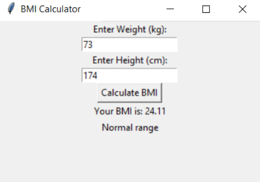
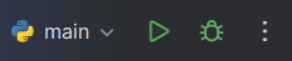
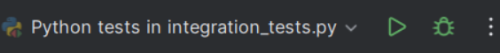

# Akademia Tarnowska
## Kurs
Testowanie i Jakość Oprogramowania / Projekt
## Autor
Bartosz Kmiecik
## Temat projektu
Testowanie aplikacji obliczającej BMI
## Opis projektu

**BMI** to współczynnik powstały przez podzielenie masy ciała podanej w kilogramach przez kwadrat wysokości podanej w metrach. Klasyfikacja (zakres wartości) wskaźnika BMI została opracowana wyłącznie dla dorosłych i nie może być stosowana u dzieci. Oznaczanie wskaźnika masy ciała ma znaczenie w ocenie zagrożenia chorobami związanymi z nadwagą i otyłością, np. cukrzycą, chorobą niedokrwienną serca, miażdżycą. Przyjmuje się, że większe BMI wiąże się ze zwiększonym ryzykiem dla zdrowia i życia.
## Uruchomienie projektu
Projekt należy otworzyć w zintegrowanym środowisku programistycznym(IDE) wspierających kompilację kodu napisanego w języku Python (np. PyCharm). W IDE należy wybrać i uruchomić plik main.py.

## Uruchomienie testów jednostkowych
Projekt należy otworzyć w zintegrowanym środowisku programistycznym(IDE) wspierających kompilację kodu napisanego w języku Python (np. PyCharm). W IDE należy wybrać i uruchomić plik unit_tests.py.

## Uruchomienie testów integracyjnych
Projekt należy otworzyć w zintegrowanym środowisku programistycznym(IDE) wspierających kompilację kodu napisanego w języku Python (np. PyCharm). W IDE należy wybrać i uruchomić plik integration_tests.py.

## Scenariusze testowe dla testera manualnego
| Test Case ID  | Opis | Kroki testowe | Oczekiwany wynik |
| ------------- | ------------- | ------------- | ------------- |
| TC_01  | Wprowadzenie poprawnych wartości. | 1. W polu Entry Weight (kg) wprowadź wartość 70.
1. W polu Entry Height (kg) wprowadź wartość 175. | Your BMI is: 22.86 Normal range |
| TC_02  | Podanie wzrostu o wartości 0. | 2. W polu Entry Weight (kg) wprowadź wartość 70.
2. W polu Entry Height (kg) wprowadź wartość 0. | Error: Height cannot be zero. |
