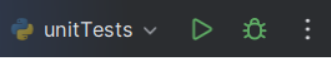

# Akademia Tarnowska
## Kurs
Testowanie i Jakość Oprogramowania / Projekt
## Autor
Bartosz Kmiecik
## Temat projektu
Testowanie aplikacji obliczającej BMI
## Opis projektu

**BMI** to współczynnik powstały przez podzielenie masy ciała podanej w kilogramach przez kwadrat wysokości podanej w metrach. Klasyfikacja (zakres wartości) wskaźnika BMI została opracowana wyłącznie dla dorosłych i nie może być stosowana u dzieci. Oznaczanie wskaźnika masy ciała ma znaczenie w ocenie zagrożenia chorobami związanymi z nadwagą i otyłością, np. cukrzycą, chorobą niedokrwienną serca, miażdżycą. Przyjmuje się, że większe BMI wiąże się ze zwiększonym ryzykiem dla zdrowia i życia.
## Uruchomienie projektu
Projekt należy otworzyć w zintegrowanym środowisku programistycznym(IDE) wspierających kompilację kodu napisanego w języku Python (np. PyCharm). W IDE należy wybrać i uruchomić plik main.py.

## Uruchomienie testów jednostkowych
Projekt należy otworzyć w zintegrowanym środowisku programistycznym(IDE) wspierających kompilację kodu napisanego w języku Python (np. PyCharm). W IDE należy wybrać i uruchomić plik unit_tests.py.

## Uruchomienie testów integracyjnych
Projekt należy otworzyć w zintegrowanym środowisku programistycznym(IDE) wspierających kompilację kodu napisanego w języku Python (np. PyCharm). W IDE należy wybrać i uruchomić plik integration_tests.py.

## Scenariusze testowe dla testera manualnego
| Test Case ID  | Opis | Kroki testowe | Oczekiwany wynik |
| ------------- | ------------- | ------------- | ------------- |
| TC_01  | Wprowadzenie poprawnych wartości. | W polu Entry Weight (kg) wprowadź wartość 70. W polu Entry Height (kg) wprowadź wartość 175. | Your BMI is: 22.86 Normal range |
| TC_02  | Podanie wzrostu o wartości 0. | W polu Entry Weight (kg) wprowadź wartość 70. W polu Entry Height (kg) wprowadź wartość 0. | Error: Height cannot be zero. |
| TC_03  | Sprawdzenie kategorii *Underweight (Severe thinness)*. | W polu Entry Weight (kg) wprowadź wartość 10. W polu Entry Height (kg) wprowadź wartość 150. | Your BMI is: 4.44 Underweight (Severe thinness) |
| TC_04  | Sprawdzenie kategorii *Underweight (Moderate thinness)*. | W polu Entry Weight (kg) wprowadź wartość 38. W polu Entry Height (kg) wprowadź wartość 150. | Your BMI is: 16.89 Underweight (Moderate thinness) |
| TC_05  | Sprawdzenie kategorii *Underweight (Mild thinness)*. | W polu Entry Weight (kg) wprowadź wartość 40. W polu Entry Height (kg) wprowadź wartość 150. | Your BMI is: 17.78 Underweight (Mild thinness) |
| TC_06  | Sprawdzenie kategorii *Overweight (Pre-obese)*. | W polu Entry Weight (kg) wprowadź wartość 65. W polu Entry Height (kg) wprowadź wartość 150. | Your BMI is: 28.89 Overweight (Pre-obese) |
| TC_07  | Sprawdzenie kategorii *Obese (Class I)*. | W polu Entry Weight (kg) wprowadź wartość 72. W polu Entry Height (kg) wprowadź wartość 150. | Your BMI is: 32.0 Obese (Class I) |
| TC_08  | Sprawdzenie kategorii *Obese (Class II)*. | W polu Entry Weight (kg) wprowadź wartość 85. W polu Entry Height (kg) wprowadź wartość 150. | Your BMI is: 37.78 Obese (Class II) |
| TC_09  | Sprawdzenie kategorii *Obese (Class III)*. | W polu Entry Weight (kg) wprowadź wartość 150. W polu Entry Height (kg) wprowadź wartość 150. | Your BMI is: 66.67 Obese (Class III) |
| TC_10  | Podanie wagi o wartości 0. | W polu Entry Weight (kg) wprowadź wartość 0. W polu Entry Height (kg) wprowadź wartość 150. | Your BMI is: 0.0 Underweight (Severe thinness) |
## Technologie użyte w projekcie
- Python 3.7.0
  - tkinter
  - unittest
